# Elastic Observability MCP App

An [MCP App](https://modelcontextprotocol.io/extensions/apps/overview) that brings interactive SRE workflows for Elastic Observability directly into Claude, VS Code, and other MCP-compatible AI hosts. Built on the [Model Context Protocol](https://modelcontextprotocol.io/) with interactive UI extensions that render inline in the conversation.

> **What are MCP Apps?** MCP Apps extend the Model Context Protocol to let tool servers return interactive HTML interfaces — dashboards, forms, visualizations — that render inside the AI conversation. The LLM calls a tool, and instead of just returning text, an interactive UI appears alongside the response.

## What This Does

This project provides six interactive SRE tools, each with a rich React-based UI that renders inline when Claude (or another MCP host) calls the tool. The **Dependency** column shows what each tool needs from your deployment — **Universal** tools work on any Elastic Observability cluster; the others require APM, ML, or Kubernetes telemetry.


| Tool | Dependency | What It Does |
|------|-----------|--------------|
| **observe** | Universal | Transient ES\|QL + ML-anomaly access primitive — run a query once, live-sample a metric, or block until a threshold or anomaly fires. |
| **manage-alerts** | Universal *(needs Kibana)* | Create, list, get, and delete Kibana custom-threshold alerting rules. Omit the Kibana URL to run read-only. |
| **ml-anomalies** | ML jobs | Query ML anomaly records and open an inline anomaly-explainer view. |
| **apm-health-summary** | Elastic APM | Cluster-level health rollup from APM telemetry; layers in K8s and ML context when available. |
| **apm-service-dependencies** | Elastic APM | Service dependency graph — upstream/downstream, protocols, call volume. |
| **k8s-blast-radius** | Kubernetes metrics | Node-outage impact — full outage, degraded, unaffected, reschedule feasibility. |

Every tool emits an `investigation_actions` list so the UI can surface opinionated next-step prompts — click-to-send without forcing the user to guess the right follow-up tool.

## Quick Start

> [!TIP]
> **Just want to try it?** Download **[example-mcp-app-observability.mcpb](https://github.com/elastic/example-mcp-app-observability/releases/latest/download/example-mcp-app-observability.mcpb)** and double-click it. No Node.js, no cloning, no config files.
>
> Claude Desktop handles the rest — you'll be prompted for your Elasticsearch URL and API key during install. That's it.

For other hosts (Cursor, VS Code, Claude Code) or building from source, see [Installation](#installation) below.

An Agent Builder workflow ships alongside — for clients that prefer Agent Builder workflows over MCP tools:

- `k8s-crashloop-investigation-otel` — automatic CrashLoopBackOff / OOMKilled investigation for clusters on the OTel ingest path (EDOT / kube-stack). Pulls pod context, ML anomalies, upstream health, and recent changes, then synthesizes a root-cause hypothesis.

## How It Works

When a user asks Claude to observe a metric or assess blast radius, Claude calls a model-facing tool on this server. The tool returns a compact text summary to Claude **and** an interactive React UI that renders inline in the conversation. The UI then calls app-only tools directly for all subsequent interactions — keeping the LLM context small while the UI has full data access.

### Architecture



### Request flow



### Skills

The `skills/` directory contains [Claude Skills](https://claude.com/docs/skills/overview) — `SKILL.md` files that teach Claude *when* and *how* to use the tools. Each skill teaches the agent to reach for the paired tool and fill its parameters from natural-language user intent, so users don't need to know tool names or deployment specifics. Skills ship as separate `.zip` artifacts (one per tool); upload individually in Claude Desktop via **Customize → Skills → Create Skill → Upload a skill**.

## Installation

| Guide | Description |
|-------|-------------|
| [Add to Claude Desktop](docs/setup-claude-desktop.md) | Install the MCP app via one-click `.mcpb` or manual config |
| [Add to Cursor](docs/setup-cursor.md) | Connect the MCP app via npx or a locally running server |
| [Add to VS Code](docs/setup-vscode.md) | Connect the MCP app via npx or a locally running server |
| [Add to Claude Code](docs/setup-claude-code.md) | Register the MCP app via the `claude mcp add` CLI |
| [Add to Claude.ai](docs/setup-claude-ai.md) | Expose the MCP app via a cloudflared tunnel |
| [Build and run locally](docs/setup-local.md) | Build the MCP server from source and run it on your machine |
| [Install skills](docs/setup-skills.md) | Install skills via npx, local clone, or zip upload |

### Requirements

- Node ≥ 22
- An Elasticsearch cluster with OpenTelemetry data (EDOT + kube-stack recommended)
- A Kibana instance with Alerting enabled — **optional**; required only for `manage-alerts`. Omit the Kibana URL to run the server strictly read-only.

### Data schema

The tools primarily target OpenTelemetry-native data in Elastic — EDOT agents or an OTel Collector writing via APM Server is the best-supported ingest path. Classic APM agents and ECS-style Kubernetes deployments are supported via a tiered fallback: tools try the OTel-native path first, and only fall back to classic APM (`traces-apm*`) or ECS-style K8s (`kubernetes.*`) when the OTel path returns nothing. OTel-native deployments don't pay the cost of the extra queries.

**Tiered query strategy:**

| Tier | Where it queries | When it runs |
|------|-----------------|-------------|
| 1 — Pre-aggregated APM metrics | `metrics-service_summary.1m.otel-*`, `metrics-service_transaction.1m.otel-*`, `metrics-service_destination.1m.otel-*` | First, for `apm-health-summary` and `apm-service-dependencies`. Emitted by APM Server regardless of agent type, so classic-APM customers are usually covered here already. |
| 2 — Raw OTel traces | `traces-*.otel-*` (`duration` ns, `status.code`, `kind`, `service.name`, `rpc.service`, `k8s.*` OTel semconv) | Only if tier 1 is empty. |
| 3 — Classic APM traces | `traces-apm*` (`transaction.duration.us`, `event.outcome`, `processor.event == "transaction"`, `kubernetes.*` ECS fields) | Only if tiers 1 and 2 are empty. |

**Kubernetes attributes:**

- OTel semconv (`k8s.namespace.name`, `k8s.deployment.name`, `k8s.pod.name`, `k8s.node.name`) is the primary path across all tools. `k8s-blast-radius` requires `metrics-kubeletstatsreceiver.otel-*` for pod impact analysis.
- ECS-style (`kubernetes.namespace`, `kubernetes.deployment.name`) is used as a fallback for downstream service impact and service rollups when no OTel telemetry is present. Not yet wired into the blast-radius pod impact core (kubeletstats OTel is still required for that).

**What's not yet supported:**

- **Direct pod-impact analysis against ECS-style K8s metrics** — `k8s-blast-radius` still requires OTel `metrics-kubeletstatsreceiver.otel-*` for the pod / memory / rescheduling core. ECS `metricbeat`-style K8s metrics could be added if there's demand.

## Development

```bash
npm run dev          # Watch mode
npm run typecheck    # Type-check only
npm run build:views  # Build views only
npm run build:server # Build server only
```

See [CONTRIBUTING.md](CONTRIBUTING.md) for project structure, build targets (`.mcpb`, `.tgz`, skill zips), and the release process.

## Inspired By

- [Elastic Agent Skills](https://github.com/elastic/agent-skills) — SRE triage methodology and observability skill patterns
- [MCP Apps Specification](https://modelcontextprotocol.io/extensions/apps/overview) — Interactive UI extensions for MCP

## License

Elastic-2.0
